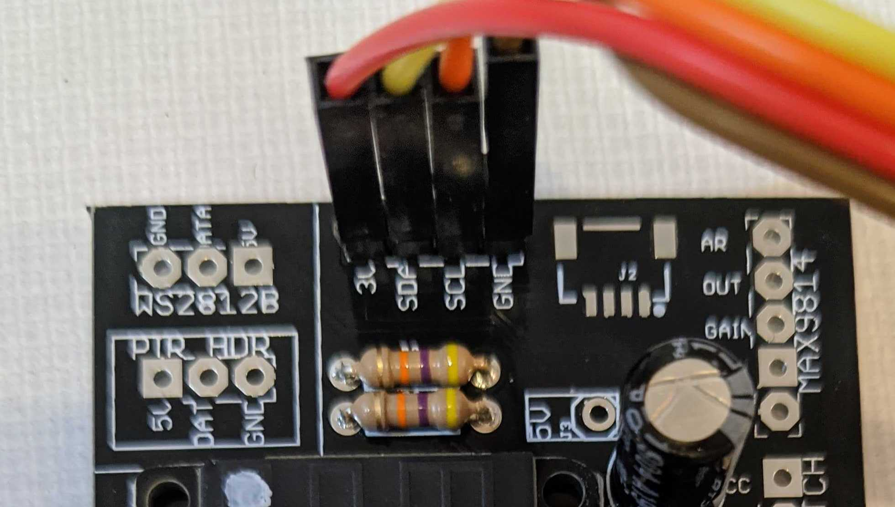

# Notes about the Air Quality Monitor Furball

## Hardware

The monitor uses an Wemos LOLIN32 ESP32 breakout board. The software will work with other ESP32 boards but the printed circuit board will only work with the LOLIN32 and compatible breakout boards. When I first started making these boards the LOLIN32 was common and easily available; unfortunately that's no longer true.

It uses a [Plantower PMS5003](https://www.aqmd.gov/docs/default-source/aq-spec/resources-page/plantower-pms5003-manual_v2-3.pdf) particle sensor that can report the density of PM1, PM2.5 and PM10 (1, 2.5 and 10 micron particles) in the air. The Plantower sensor uses a cable that requires a surface mount connector on the printed circuit board.

Optionally it also uses an I2C [BME680](https://www.bosch-sensortec.com/products/environmental-sensors/gas-sensors-bme680/) atmospheric sensor to report air temperature, pressure, humidity, and volatile organics; a [TSL2561](https://ams.com/tsl2561) light sensor to report lux, light intensity and infrared, and an [SSD1306](http://www.solomon-systech.com/en/product/advanced-display/oled-display-driver-ic/ssd1306/) 128x64 OLED display.

### Pins

#### I2C

These are the default I2C pins on many ESP32 breakout boards.

- SDA - GPIO21
- SCL - GPIO22

#### PMS5003 (serial interface)

- ESP32 TX - PMS5003 RCV - GPIO16  
- ESP32 RCV - PMS5003 TX - GPIO17 

#### I2C Addresses

- BME680 -  0x77 - atmospheric sensor
- TSL2561 - 0x39  - light sensor
- SSD1306 - 0x3c - 128x64 OLED display

## Wiring the OLED Display

The original Furball didn't use a display. We'll attach the OLED display to the four pin I2C header at the top middle of the board. If you can, solder a 4 pin header strip to the board and use female-to-female jumper wires. The I2C header wasn't designed specifically for this OLED display, so its pins are in a slightly different order.
- 3V to VCC
- SDA to SDA
- SCL to SCL
- GND to GND



## Configuring Software

1. Copy `src/config.h-example` to `src/config.h`
2. Edit `src/config.h` to set up to three sets of wifi network credentials to connect to.
3. If you're using the external OLED display, set `DISPLAY_SCREEN_INTERVAL` to the number of milliseconds a screen will display before it swtiches to the next screen.
4. If you're using the external OLED display, set `DISPLAY_SCREENS` to an array of screen types (see below) that select the set of screens you'll see.
3. If you're using the external OLED display, set `DISPLAY_SCREEN_MESSAGE_TEXT` to the text message that the message screen will display.

## Configuring Screens

If you're using it, the OLED display will cycle between showing multiple values. You can select the set of values it will show. Configure the array of values using the `DISPLAY_SCREENS` constant in `src/config.h`.

The available screen types are listed in `src/display.h`. They include:
-  `DISPLAY_SCREEN_MESSAGE` - shows a fixed text message defined by `DISPLAY_SCREEN_MESSAGE_TEXT`
-  `DISPLAY_SCREEN_TIME` - shows the current time
-  `DISPLAY_SCREEN_TEMPERATURE` - shows the current temperature in C
-  `DISPLAY_SCREEN_TEMPERATURE_F` - shows temperature in F 
-  `DISPLAY_SCREEN_HUMIDITY` - shows the current relative humidity
-  `DISPLAY_SCREEN_PRESSURE` - shows the current air pressure
-  `DISPLAY_SCREEN_VOC` - shows the current gas resistance reading from the BME680
-  `DISPLAY_SCREEN_PM1` - shows the current PM1 density from the PMS5003
-  `DISPLAY_SCREEN_PM2_5 ` - shows the current PM2.5 density from the PMS5003
-  `DISPLAY_SCREEN_PM10 ` - shows the current PM10 density from the PMS5003
-  `DISPLAY_SCREEN_LUX` - shows the current light intensity in lux
-  `DISPLAY_SCREEN_INFRARED` - shows the current infrared light intensity
-  `DISPLAY_SCREEN_IP` - shows the current IP address
-  `DISPLAY_SCREEN_ALL_AIR` - shows temperature in C, humidity and pressure on one screen 
-  `DISPLAY_SCREEN_ALL_AIR_F` - shows temperature in F, humidity and pressure on one screen 
-  `DISPLAY_SCREEN_ALL_LIGHT` - shows lux and ir on one screen
-  `DISPLAY_SCREEN_ALL_PARTICLE` - shows PM1, PM2.5 and PM10 concentrations on one screen
-  `DISPLAY_SCREEN_ALL_OFF` - shows a blank, dark screen
-  `DISPLAY_SCREEN_ALL_ON` - shows a fully lit screen 
-  `DISPLAY_SCREEN_AQI` - shows a the current, instantaneous AQI as well as condition name 
-  `DISPLAY_SCREEN_POOP` - shows the poop emoji 
-  `DISPLAY_SCREEN_USER_BITMAP1` - shows user-defined bitmap 1 
-  `DISPLAY_SCREEN_USER_BITMAP2` - shows user-defined bitmap 2
-  `DISPLAY_SCREEN_USER_BITMAP3` - shows user-defined bitmap 3 
- `DISPLAY_SCREEN_RBG` - RBG

For example, if you want to cycle every 10 seconds between a screen that says "Hello World", one that shows the time and one that shows the temperature, you'd use these lines:
```
#define DISPLAY_SCREEN_INTERVAL 10000
#define DISPLAY_SCREENS { DISPLAY_SCREEN_MESSAGE, DISPLAY_SCREEN_TIME, DISPLAY_SCREEN_TEMPERATURE }
#define DISPLAY_SCREEN_MESSAGE_TEXT "Hello World"
```

If you want to always show the PM2.5 density and nothing else, you'd use these lines:
```
#define DISPLAY_SCREEN_INTERVAL 1000
#define DISPLAY_SCREENS { DISPLAY_SCREEN_PM2_5 }
#define DISPLAY_SCREEN_MESSAGE_TEXT "this doesn't matter but must still be defined"
```

If you want to show a blank screen for 5 seconds and all three particle densities at once for 20 seconds you'd use these lines:
```
#define DISPLAY_SCREEN_INTERVAL 5000
#define DISPLAY_SCREENS { DISPLAY_SCREEN_ALL_OFF,  DISPLAY_SCREEN_ALL_PARTICLE,  DISPLAY_SCREEN_ALL_PARTICLE,  DISPLAY_SCREEN_ALL_PARTICLE,  DISPLAY_SCREEN_ALL_PARTICLE }
#define DISPLAY_SCREEN_MESSAGE_TEXT "this doesn't matter but must still be defined"
```

Internally the firmware uses the [u8g2 graphics library](https://github.com/olikraus/u8g2) to manage and draw on the OLED display.

## Providing a Bitmap

The three user bitmaps have default definitions in `src/user_bitmap.cpp` in XBM format, which encodes them as an array of bytes in C. You can override these in `src/config.h` by defining the constants `DISPLAY_SCREEN_USER_BITMAP1`, `DISPLAY_SCREEN_USER_BITMAP2` and `DISPLAY_SCREEN_USER_BITMAP3`, like so:
```
#define DISPLAY_SCREEN_USER_BITMAP1_OVERRIDE   0xFF, 0xFF, 0xFF, 0xFF, 0xFF, 0xFF, 0xFF, 0xFF, 0x22, 0xFF, 0xFF, 0xFF, \
  0xFF, 0xFF, 0xFF, 0xFF, 0xFF, 0xFF, 0xFF, 0xFF, 0xFF, 0xFF, 0xFF, 0xFF, \
  0x0F, 0xFF, 0xFF, 0xFF, 0xFF, 0xFF, 0xFF, 0xFF, 0xFF, 0xFF, 0xFF, 0xFF, \
  0xFF, 0xFF, 0xFF, 0xFF, 0x0F, 0xFC, 0xFF, 0xFF, 0xFF, 0xFF, 0xFF, 0xFF, \
  0xFF, 0xFF, 0xFF, 0xFF, 0xFF, 0xFF, 0xFF, 0xFF, 0x07, 0xF0, 0xFF, 0xFF, \
  0xFF, 0xFF, 0xFF, 0xFF, 0xFF, 0xFF, 0xFF, 0xFF, 0xFF, 0xFF, 0xFF, 0xFF, \
  0x3F, 0xE0, 0xFF, 0xFF, 0xFF, 0xFF, 0xFF, 0xFF, 0xFF, 0xFF, 0xFF, 0xFF, \
  ...
```
be sure to include all the hex numbers for the bitmap. Don't end the final line with a `\`.

Overriding the definitions allows you to customize them without modifying any files that are checked into the repository.

Bitmap images must be 128x64, monochrome. You can easily convert other file formats using [ImageMagick's](https://www.imagemagick.org/) `convert` program:
```
convert poop-emoji.jpg user_bitmap.xmb
```
Copy and paste just the contents of the array to the constant in `src/config.h`.

## Thanks

Thanks to nyx for the AQI code.
